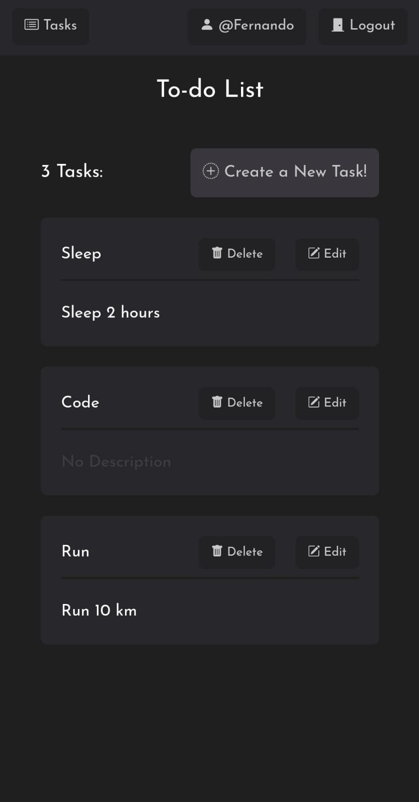
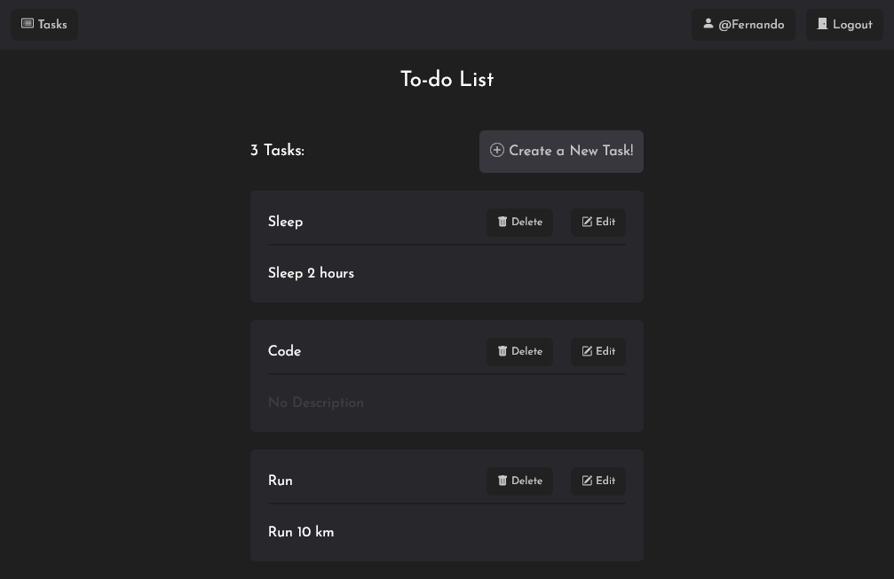

# Full-Stack To-Do App

This full-stack project encompasses a web application for task management ("to-do list"), meticulously developed in both frontend and backend domains.

## Table of contents

- [Overview](#overview)
  - [The challenge](#the-challenge)
  - [Screenshot](#screenshot)
  - [Links](#links)
- [My process](#my-process)
  - [Built with](#built-with)
- [Author](#author)

## Overview

### The Project

This comprehensive full-stack project introduces a feature-rich web application designed for task management ("to-do list"). The application facilitates the creation, editing, and deletion of tasks, providing users with a robust tool for efficient task organization. Notably, the platform includes user authentication functionality, ensuring secure access to private profiles.

On the frontend, the application is crafted using a diverse stack of technologies, including HTML, CSS, Sass, JavaScript, React, Tailwind CSS, React Router, and Redux. This ensures a responsive, dynamic, and seamless user experience. The frontend technologies collectively contribute to an engaging and visually appealing interface.

Meanwhile, the backend is powered by Node.js and Express, creating a robust server-side foundation. Data is managed through MongoDB, with Mongoose serving as the object modeling tool. To enhance security and authentication, the backend leverages additional libraries such as bcryptjs for password hashing, cookie-parser for handling cookies, and jsonwebtoken for secure token generation and validation. This combination of technologies ensures efficient data storage and retrieval, scalability, and robust security measures, resulting in a well-rounded full-stack application that excels in task management and user authentication.

### Screenshot

### Links

- Solution URL: [Github](https://github.com/SFCC5555/new-to-do-list_app)
- Live Site URL: [Full-Stack To-Do App](https://to-do-list.xyz/)

## My process

### Built with

- Semantic HTML5 markup
- CSS custom properties
- Flexbox
- CSS Grid
- Mobile-first workflow
- JavaScript
- Axios
- Sass
- Tailwind
- Bootstrap icons
- React Router V6
- Redux
- [React](https://reactjs.org/) - JS library
- Node.js
- Express
- Mongoose
- MongoDB
- Postman
- bcryptjs
- cookie-parser
- jsonwebtoken

## Author

- [Website](https://sfcc5555.netlify.app/)
- [LinkedIn ](https://www.linkedin.com/in/fernando-carrasco-dev/)
